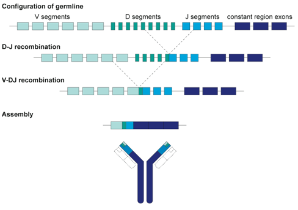
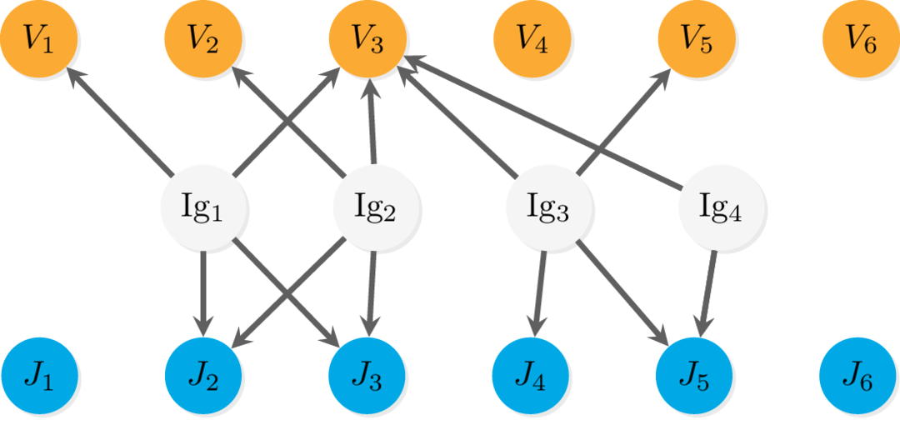
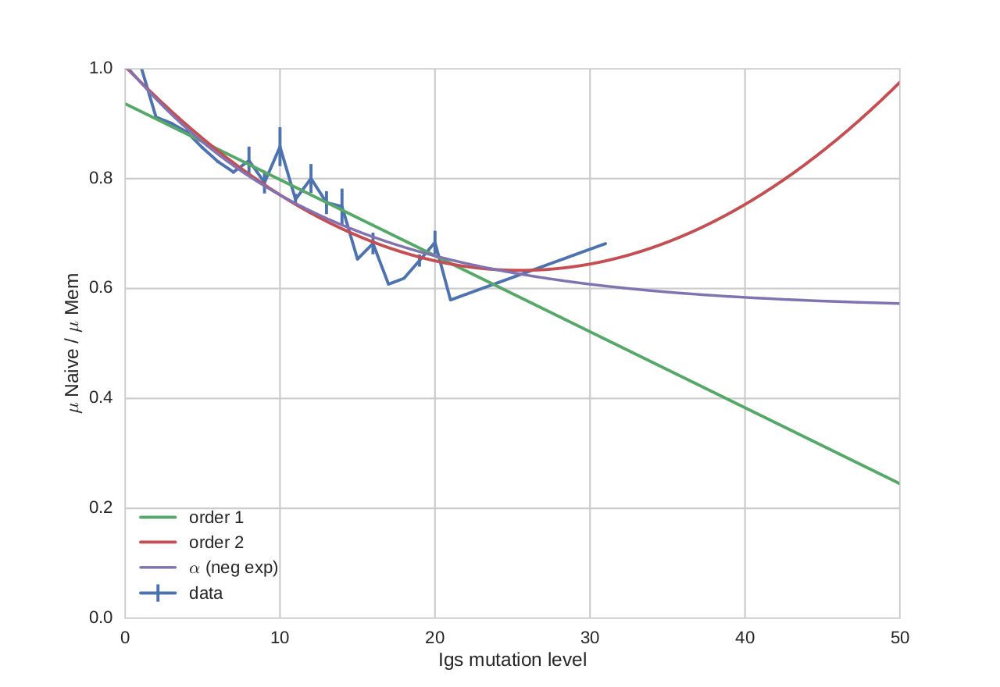

.. _overview:

Framework overview
===================
IGNET is an implementation of an unsupervised learning technique used to 
identify clones, which are groups of immunoglobulins which share a common
ancestor. The method is particularly tailored for the immunoglobulin (Ig) 
primary sequence data type. Such method aims to divide Igs in `clones`, 
which are sets of Igs deriving from the same original
combination of genes, called `germline`. 

The method acts like a clustering method, in which however the innovation
comes from the choice of the distance function, highly customisable and tunable
for the immunoglobulin data type. Not only this is
done by choosing one of the standard distances used in graph theory (e.g.
Jaccard, Simpson), but also by assigning a different weight to common
V or J genes. Furthermore, each distance is adjusted according to the
mutation levels of the compared Igs. In this way the method is capable of
considering as similar two Igs even when at least one of them is highly
mutated, thus not easily recognisable. Such method allows to define a
customisable and reliable clustering to identifying Ig clones. Ig clustering
is useful to understand how much variability an individual has in its
immune response. An healthy individual, for example, is expected to have
a very high number of germlines. Therefore in this case the method should
extract an high number of clusters. Such variability in his Igs ensures
a generalised immune response towards a wide range of antigens. Igs
clustering is a tough problem because of their structure, high mutation
level, and variable gene composition.

Immunoglobulin structure
------------------------
Igs are composed by an heavy and a light chain. Each chain has
three complementarity determining regions (CDRs) which bind the Ig
to antigens. Obviously, the more variable CDRs are, the more antigens
Igs can bind to. Considering all six CDRs, HCDR3 (the third CDR of the
heavy Ig chain) is the most hypervariable region. Since the most variable
CDR is on the heavy chain, for brevity, when we refer to Igs we consider
only the heavy chain of their primary structure.
More specifically, the Ig primary structure is formed by the ordered
combination of three types of genes (V, D and J). When building a new
Ig, those genes are selected almost randomly. While putting together V, D
and J genes, some nucleotides between V–D and D–J are lost or almost-randomly 
inserted. Given the small length of the D genes, this procedure
cause the D gene to be too different from the original, so it will not be taken into
account singularly as the V or J genes. Instead, we will refer to the last
small portion of V, D and the first small portion of J genes as the `junction`,
or HCDR3. This is actually the hypervariable loop which binds the Ig to
antigens.

   
When an Ig is first formed and before encountering an antigen, the Ig
is called `naive`. This type of Igs have low (or zero) mutation levels. In an
healthy individual immune response, when Igs encounter an antigen, they
undergo a series of mutations to maximise the possibility of binding to the
antigen. After the immune response, Igs which did not bind to antigens but
evolved after encountering the antigen are called `memory`. This type of
Igs has usually high levels of mutations. Since mutations are the normal
behaviour of Igs, a clustering on this type of data has an intrinsic difficulty.
The Igs ability to mutate to be able to bind to antigens is essential to an
healthy immune response. In contrast, an individual affected by diseases
like leukemias has Igs with reduced (or zero) capability to mutate in
response to a new antigen. In this case an Ig clustering method is expected
to find a very small number of clones.

Approach
--------
The task is not trivial because of the type of data at hand.
The information the method is based on are a previous assignment of V and J genes made
by IMGT/High-VQUEST [Brochet08]_ starting from Ig primary
sequences. Only the primary sequence of each Ig is considered. In this
way, a main problem is to choose a valid metric between sequences. Since
Ig primary sequences can be simply represented by a list of characters
(both nucleotide and amminoacid representations), an edit distance like
Hamming may suffice. Hamming distance between two strings of equal
length is the sum of the different characters in the same position inside the
string. Also, instead of assigning 1 if the two characters are not the same,
weights can be modified based on the actual character encountered (e.g.
A-G can have a distance different from A-T). In this way another distance
can be defined, such as HS1F, which is specifically tailored for Ig analysis
[Yaari13]_. This distance is already used in Change-O [Gupta15]_, 
a collection of tools for the Immunoglobulin sequence analysis. In
particular, our method was originally based on the pipeline proposed by
Change-O, which is composed by two steps: firstly, it groups Igs which
have at least one V or J in common and same junction length; secondly,
it performs a hierarchical clustering for each group defined before. One
limitation of Change-O is that the measure of similarity between sequences
is not very tunable: for example, two Igs can be put in the same cluster only
because they have one V or J gene in common, without the calculation of
an actual similarity between the sequences based on how many genes they
have in common.

Method overview
---------------
The method proposed is based on the prior information that tools such
as IMGT/High-VQUEST extracts at the preprocessing data step. The
main information our method use is the assignment of most probable
(possibly multiple) V and J genes to the Ig. The V and J genes assigned
are called V and J calls, respectively. The overall similarity is measured
by combining a graph-based method and the comparison between the
junctions (hypervariable regions). The method then builds a normalised affinity
matrix `S`.

In particular, one can tune the similarity between two immunoglobulins using
indices coming from graph theory. Visualising the assignment of V and J genes
for each immunoglobulin Ig_i, one obtain the following graph:

which is a particular type of graph, namely a double bipartite graph.
In this way, a long set of similarity methods between nodes of a graph can be
used, such as Jaccard o Simpson indices.

Such similarity function is only the first step of the analysis.
Once having identified the group of Igs with similarity greater than zero,
then the distance measure is adjusted with the similarity in the immunoglobulins
structure of their junctions, that is the string similarity between nucleotides
(or amminoacids) of a part of the V gene, a part of the J gene annd the D gene.

Also, since an high level of mutation in the immunoglobulin is very common
(or better, it is the `normal` behaviour of an healty immune system),
this information must be kept and taken into account. In particular,
since the mutation level can be high, the similarity measure as computed
up to now can be less reliable.
Therefore, in order to have a normalised distance distribution between immunoglobulins,
the distance between them is adjusted based on the mutation level of each immunoglobulin
of which the distance is being computed.
In particular, the distance between two Igs is decremented if at least one of them
has an high mutation level.

The curve which control the distance adjustment has been empirically obtained by
fitting a curve with the mean distribution of the distances on the mutation level
of the Igs considered.

In the plot, the function which controls the similarity of two Igs based on their 
mutations assumes the shape of a negative exponential. This type of function
is also very nice because of its properties, that are the fact that it starts from 1
and never reach 0. This means that the similarity between two Igs with no mutations
is unchanged (`i.e.`, the similarity computed is reliable), while the similarity
between two Igs with a very high mutation level, in any case, is never set to zero
only because of their mutations.

.. rubric::
Reference
---------

.. [Brochet08]  Brochet, Xavier, Marie-Paule Lefranc, Véronique Giudicelli,
                **IMGT/V-QUEST: the highly customized and integrated system for
                IG and TR standardized VJ and VDJ sequence analysis**.
                Nucleic acids research 36.suppl 2 (2008): W503-W508.

.. [Yaari13]    Yaari G, Vander Heiden JA, Uduman M, et al. 
                **Models of Somatic Hypermutation Targeting and Substitution 
                Based on Synonymous Mutations from High-Throughput Immunoglobulin 
                Sequencing Data**. 
                Frontiers in Immunology. 2013;4:358. doi:10.3389/fimmu.2013.00358.

.. [Gupta15]    Gupta, Namita T., Jason A. Vander Heiden, Mohamed Uduman, et al. 
                **Change-O: a toolkit for analyzing large-scale B cell 
                immunoglobulin repertoire sequencing data**.
                Bioinformatics 31, no. 20 (2015): 3356-3358.

.. [Bagnara15]  Bagnara, Davide, Margherita Squillario, David Kipling, et al.
                **A reassessment of IgM memory subsets in humans**.
                The Journal of Immunology 195, no. 8 (2015): 3716-3724.

