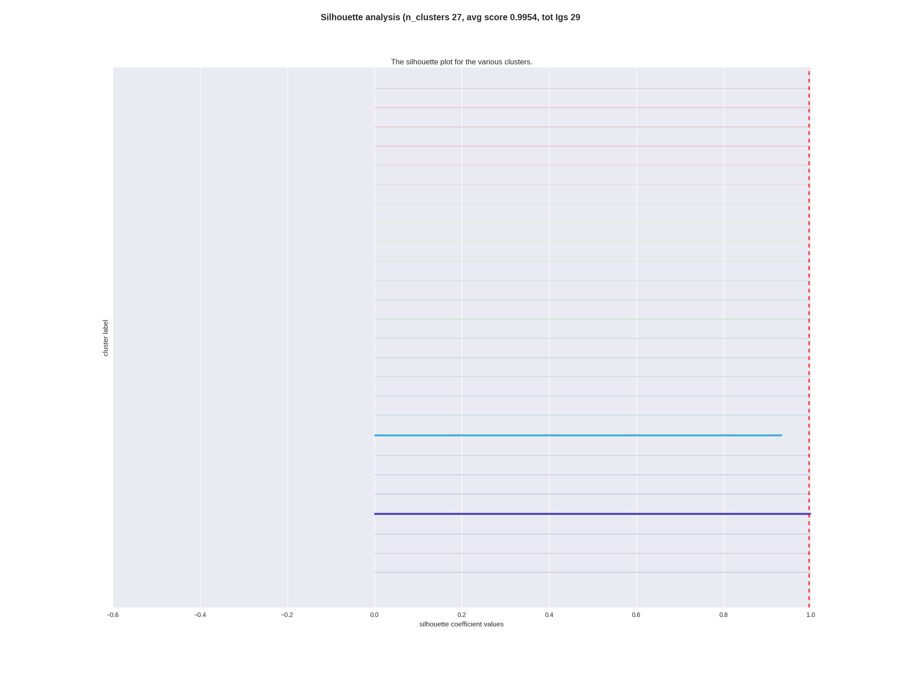

.. _tutorial:

Quick start tutorial
====================
IGNET may be installed using standard Python tools (with
administrative or sudo permissions on GNU-Linux platforms)::

    $ pip install ignet

or::

    $ easy_install ignet

Installation from sources
-------------------------
If you like to manually install IGNET, download the .zip or .tar.gz archive
from `<http://slipguru.github.io/ignet/>`_. Then extract it and move into the root directory::

    $ unzip slipguru-ignet-|release|.zip
    $ cd ignet-|release|/

or::

    $ tar xvf slipguru-ignet-|release|.tar.gz
    $ cd ignet-|release|/

Otherwise you can clone our `GitHub repository <https://github.com/slipguru/ignet>`_::

   $ git clone https://github.com/slipguru/ignet.git

From here, you can follow the standard Python installation step::

    $ python setup.py build_ext --inplace install

This tutorial assumes that you downloaded and extracted IGNET
source package which contains a ``examples/data`` directory with some data files (``.npy`` or ``.csv``) which will be used to show IGNET functionalities.

IGNET needs only an ingredient:

* ``input table`` of immunoglobulins

The path of ``input table`` is specified inside a ``configuration`` file, which must be passed as the only argument of the ``ig_run.py`` script.

Input data format
-----------------
Input data are assumed to be:

* tabular data stored in tab-separated ``.tab`` files (or comma-separated ``.csv`` files; see the Configuration File section on how to specify your preferred format for loading the table) presenting the variables header on the first row and the sample indexes on the first column.
The file must contain at least the following columns:

* SEQUENCE_ID
* SUBSET (optional)
* MUT (optional)
* V_CALL
* J_CALL
* JUNCTION
* JUNCTION_LENGTH (optional)

The format of the file is the same which is returned from HighV-QUEST [Brochet08]_ [#HighVQuest]_.

.. _configuration:

Configuration File
------------------
IGNET configuration file is a standard Python script. It is
imported as a module, then all the code is executed. In this file the user can define all the option needed to read the data.
A ``db_file`` filename is required. Note: to avoid problems, the path must be absolute.
Other options can be specified, regarding the file loading configuration:

* ``dialect`` is a string which is used to specify how values are separated in the database file. Only ``excel-tab`` and ``excel`` are supported by the standard library. If your database is a tab-delimited file (``.tab``), use ``excel-tab``. If the database is a comma-separated file (``.csv``), use ``excel``.
* ``subsets`` is a tuple or list of allowed immunoglobulin subsets to load. The database should contain a SUBSET column, and this variable is used to load from the database only those immunoglobulins which have a subset compatible. Names in ``subsets`` should be lowercase.
* ``mutation`` is a tuple or list composed by two float values. Only immunoglobulins which have a mutation level inside this range are loaded.
* ``apply_filter`` allows to specify the final filter which is used to load records from the database. The default filter in the configuration file allows to load records according to the previous statement. IGNET, however, allows a full customisation of the analysis. Expert users, therefore, can modify this function in order to load arbitrary records following their rules.

There are also other options which are taken into account in the analysis step.
They are:

* ``file_format`` is a string which specifies the extension of the plots to be produced, and it can be 'png' or 'pdf'.
* ``plotting_context`` is a string which specifies the seaborn context for the plots. [#seaborn]_
* ``force_silhouette`` is a boolean variable that can be defined and set to True if, independently from the dimension of the distance matrix that will be produced, the user wants to perform a silhouette analysis on the data.

.. literalinclude:: ../../ignet/config.py
   :language: python

.. _experiment:

Experiment runner
-----------------
The ``ig_run.py`` script executes the IGNET main features, that is the definition of immunoglobulin clones. The prototype is the following::

    $ ig_run.py config.py

When launched, the script reads the record database from the filename specified in the ``config.py`` file , then it perform the analysis saving the results in a tree-like structure which has the current folder as root.

.. _analysis:

Results analysis
----------------
This is an optional step. If the number of analysed records is not too high
with respect to the amount of RAM available on the machine on which experiments
are being running, then an analysis on the clustering already performed with the
``ig_run.py`` script can be done.
This script accepts as only parameter a result directory already created::

    $ ig_analysis.py result-dir

The result of the script is a graphical result which shows the silhouette
plot for each clone that has been found.
An output example obtained by one of the implemented pipelines is represented below,
where almost each clone is composed by a single Ig, because of the type of data
used in the analysis (click on it to zoom in the figure). 

-------------
You can reproduce the example above specifying ``data_source.load('circles')`` in the configuration file.

Example dataset
----------------
An example dataset can be dowloaded :download:`here <TCGA-PANCAN-HiSeq-801x20531.tar.gz>`. The dataset is a random extraction of 801 samples (with dimension 20531) measuring RNA-Seq gene expression of patients affected by 5 different types of tumor: breast invasive carcinoma (BRCA), kidney renal clear cell carcinoma (KIRC), colon  (COAD), lung  (LUAD) and prostate adenocarcinoma (PRAD). The full dataset is maintained by The Cancer Genome Atlas Pan-Cancer Project [1] and we refer to the `original repository <https://www.synapse.org/#!Synapse:syn4301332>`_ for furher details.

.. rubric:: Footnotes

.. [#HighVQuest] See ``http://www.imgt.org/HighV-QUEST/`` for further information.
.. [#seaborn] See ``https://stanford.edu/~mwaskom/software/seaborn/generated/seaborn.set_context.html`` for further information.

Reference
----------------

.. [Brochet08]  Brochet, Xavier, Marie-Paule Lefranc, Véronique Giudicelli,
                **IMGT/V-QUEST: the highly customized and integrated system for
                IG and TR standardized VJ and VDJ sequence analysis**.
                Nucleic acids research 36.suppl 2 (2008): W503-W508.
